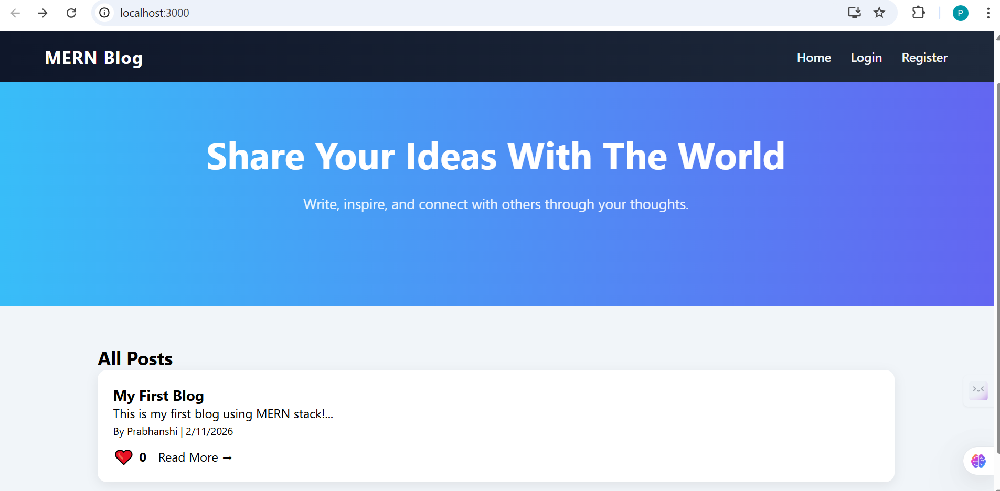
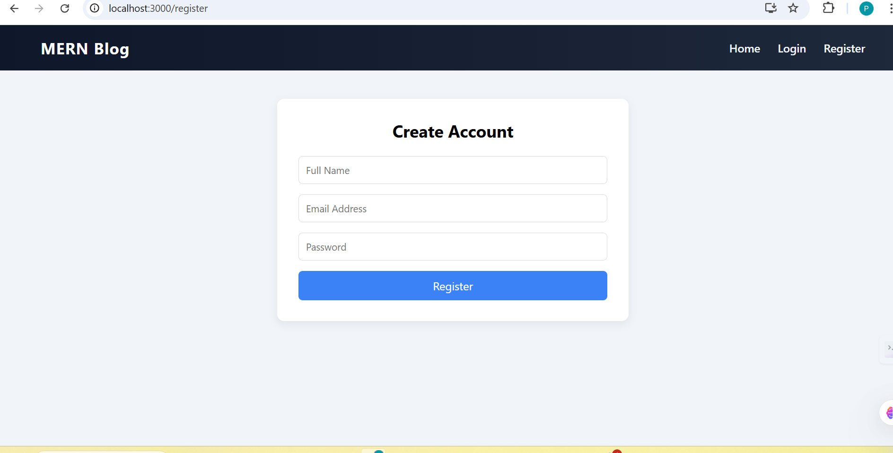
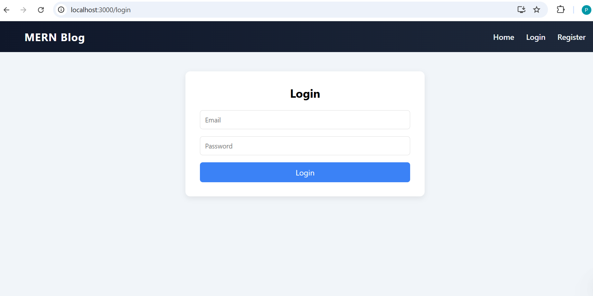
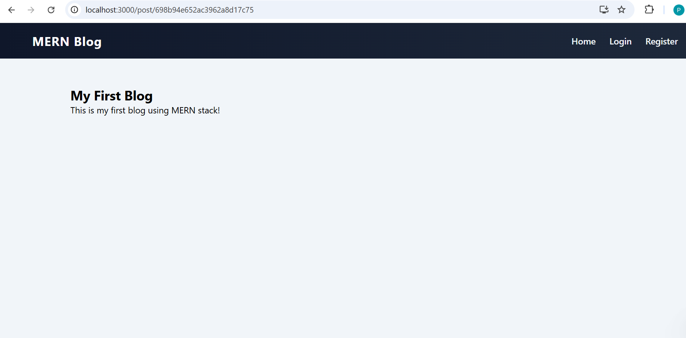

# MERN Blog Application 🚀

A full-stack blogging platform built using the MERN stack (MongoDB, Express.js, React.js, Node.js). Users can register, login, create posts, upload images, like posts, and interact with content.

---

## ✨ Features

* 🔐 User Authentication (JWT based)
* 📝 Create, Edit, Delete Blog Posts
* 📷 Image Upload Support
* ❤️ Like Posts
* 💬 Comment System
* 🌐 Responsive UI
* ⚡ REST API Backend

---

## 🛠️ Tech Stack

**Frontend**

* React.js
* Context API
* CSS

**Backend**

* Node.js
* Express.js
* MongoDB
* Mongoose
* JWT Authentication
* Multer (Image Upload)

---

## 📸 Screenshots

> Create a folder named `screenshots` in your project and upload images there.

### 🏠 Home Page



### 📚 All Posts




### 🔐 Login Page



### 📝 Create Post




---

## ⚙️ Installation & Setup

### 1️⃣ Clone Repository

```bash
git clone https://github.com/YOUR_USERNAME/blogging-website.git
cd blogging-website
```

### 2️⃣ Backend Setup

```bash
cd backend
npm install
```

Create `.env` file:

```
MONGO_URI=your_mongodb_connection
JWT_SECRET=your_secret_key
```

Run backend:

```bash
npm run dev
```

---

### 3️⃣ Frontend Setup

```bash
cd frontend
npm install
npm start
```

---

## 📂 Folder Structure

```
blogging-website/
│
├── backend/
│   ├── controllers/
│   ├── models/
│   ├── routes/
│   ├── middleware/
│   └── server.js
│
├── frontend/
│   ├── src/
│   └── public/
│
└── screenshots/
```

---

## 🔌 API Endpoints

### Auth

* POST /api/users/register
* POST /api/users/login

### Posts

* GET /api/posts
* GET /api/posts/:id
* POST /api/posts
* PUT /api/posts/:id/like
* POST /api/posts/:id/comment

---

## 👩‍💻 Author

**Prabhanshi Yadav**
B.Tech Student | MERN Developer

---

## ⭐ Future Improvements

* Search & Filter Posts
* User Profile Page
* Dark Mode
* Deployment (AWS / Render / Vercel)

---

## 📜 License

This project is for educational purposes.
